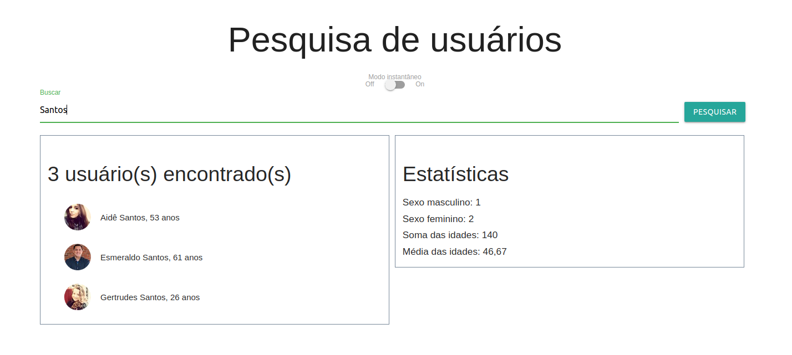

  

# Desafio01-BT-IGTI

## Este é o desafio do módulo 1 do Bootcamp de Desenvolvedor FullStack do IGTI

O desafio é criar uma aplicação que colete dados de uma determinada API e mostre as estatísticas a partir dos nomes pesquisados.

Exercitar os seguintes conceitos trabalhados no Módulo:

- Declarar elementos HTML como títulos, input, div, span, ul, li etc.

- Estilizar o app com CSS.

- Mapear elementos do DOM para serem manipulados com JavaScript.

- Formatar valores com JavaScript.

- Realizar diversos cálculos com array methods como map, filter e reduce.

- Realizar requisições HTTP com o comando fetch.
